# Obligatorio T2 — Fernandez, Minelli, Wollheim

**Link al repo:** https://github.com/NahuelFernandezGalli/Obl-T2-Fernandez-Minelli-Wollheim

Marketplace de trabajos freelance con pagos en ERC-20 y evaluación por MultiSig, desplegado en Sepolia.

## Contratos

| Contrato | Descripción |
|---|---|
| `JobMarketplace` | Contrato principal. Gestiona ciclo de vida de trabajos (Open → Funded → Submitted → Completed/Rejected/Expired). |
| `MockERC20` | Token ERC-20 de prueba con `mint` público. |
| `MultiSig` | Billetera multifirma reutilizada de la Entrega 2. Permite usar un contrato como evaluador. |

## Configuración

Crear un archivo `.env` en la raíz con:

```
SEPOLIA_RPC_URL=https://eth-sepolia.g.alchemy.com/v2/TU_API_KEY
SEPOLIA_PRIVATE_KEY=0xTU_CLAVE_PRIVADA
```

- **`SEPOLIA_RPC_URL`**: endpoint de Alchemy para Sepolia (requiere cuenta en [alchemy.com](https://alchemy.com))
- **`SEPOLIA_PRIVATE_KEY`**: clave privada de la wallet MetaMask (Ajustes → Administrar cuenta → Exportar clave privada). Asegurarse de tener ETH de Sepolia (faucet: [sepoliafaucet.com](https://sepoliafaucet.com)).

## Instalación y compilación

```bash
npm install
npm run compile
```

## Tests

```bash
npm test
```

40 tests cubren:
- **Happy path**: crear → fondear → entregar → completar
- **Rechazos**: cliente en Open, evaluador en Funded y Submitted
- **Expiración**: `claimRefund` desde Funded y Submitted, guards de estado y tiempo
- **Control de acceso**: todos los `revert` de autorización y estado
- **MultiSig como evaluador**: propuesta, threshold, ejecución y eventos

## Deploy en Sepolia

```bash
npx hardhat ignition deploy ignition/modules/JobMarketplace.ts --network sepolia
```

### Direcciones desplegadas

| Contrato | Red | Dirección |
|---|---|---|
| `MockERC20` | Sepolia | 0xe8868Aa427003Ff4dEC892176899b53a59e2bf31 |
| `JobMarketplace` | Sepolia | 0x80B0f6Fb5672020171CA6a77b390fBE2238FEfcb |

## Frontend

El frontend (Vite + React + RainbowKit + wagmi + viem) está en `frontend/`.

```bash
cd frontend
npm install
cp .env.example .env.local   # completar las variables
npm run dev
```

Variables de entorno (`frontend/.env.local`):

| Variable | Requerida | Descripción |
|---|---|---|
| `VITE_WALLETCONNECT_PROJECT_ID` | sí | Project ID de WalletConnect Cloud (RainbowKit). |
| `VITE_JOBMARKETPLACE_ADDRESS` | sí | Dirección del `JobMarketplace` en Sepolia. |
| `VITE_SEPOLIA_RPC_URL` | recomendada | RPC de lectura. Conviene tu endpoint de Alchemy (el del deploy); el público por defecto limita las consultas. Si no se setea, usa un fallback público. |
| `VITE_PINATA_JWT` | no | JWT de Pinata. Si se setea, los deliverables se suben a IPFS (ver decisiones de diseño). |
| `VITE_IPFS_GATEWAY` | no | Gateway IPFS de lectura (default `https://gateway.pinata.cloud/ipfs/`). |

Para obtener tokens de prueba (JTK) y poder fondear, `MockERC20` tiene `mint` público: se puede
mintear desde Etherscan (*Write Contract* del token) a la wallet del cliente.

## Decisiones de diseño

### Flujo de estados

```
Open → (fund) → Funded → (submit) → Submitted → (complete) → Completed
                    ↓ reject (eval)    ↓ reject (eval)
                  Rejected           Rejected
Open → reject (client) → Rejected
Funded/Submitted → (claimRefund, post-expiresAt) → Expired
```

### Patrón CEI + ReentrancyGuard

Las funciones fund, complete y reject siguen el patrón Checks-Effects-Interactions y están protegidas con ReentrancyGuard de OpenZeppelin. claimRefund también sigue CEI pero deliberadamente NO lleva ReentrancyGuard ni control de acceso

### `expiresAt` en lugar de duración

El campo `expiresAt` del job es un timestamp absoluto fijado en `createJob`. Esto evita ambigüedades sobre cuándo comienza a contar el plazo y permite al cliente elegir fechas específicas de vencimiento.

### Evaluador como dirección arbitraria

El campo `evaluator` acepta cualquier dirección, incluyendo contratos. Esto permite usar un MultiSig (u otro contrato DAO/governance) como evaluador sin cambios en el contrato.

### `deliverableRef` como bytes32

La referencia a la entrega se almacena como `bytes32`, manteniendo el contrato agnóstico al sistema de almacenamiento off-chain y reduciendo el costo de gas respecto a almacenar strings. El contenido del deliverable no se guarda on-chain (es caro y, además, no debe ser público hasta que el evaluador da el visto bueno).

### Almacenamiento del deliverable: localStorage + IPFS (híbrido, bonus)

El contenido del deliverable se guarda **off-chain** de forma híbrida, según haya o no IPFS configurado:

- **Sin IPFS (default):** `deliverableRef = keccak256(contenido)` y el contenido queda en `localStorage`. Con la limitación de que el evaluador debe abrir la app en el mismo navegador donde se hizo la entrega.
- **Con IPFS (bonus):** si se setea `VITE_PINATA_JWT`, al enviar la entrega el contenido se sube a IPFS vía Pinata y `deliverableRef` pasa a ser el **CID** del archivo. Como un CIDv0 es un multihash sha2-256 de 34 bytes (`0x12 0x20` + digest de 32 bytes), guardamos solo el digest de 32 bytes en el `bytes32` y reconstruimos el CID al leer. Así cualquier evaluador accede al deliverable **desde cualquier dispositivo**, alineado con el espíritu descentralizado del protocolo.

En ambos casos se guarda una copia local como caché. Al leer, la app intenta primero el caché local y, si no está, reconstruye el CID y lo trae desde el gateway IPFS. El contrato no cambia entre un modo y otro: siempre recibe un `bytes32`.

## Desvíos y limitaciones

- **Aprobación vía MultiSig desde su propia interfaz.** Cuando el evaluador de un trabajo es un contrato MultiSig, la aprobación (`complete`) no se dispara desde esta UI sino desde la interfaz del MultiSig: un signer crea una propuesta que llama a `complete(jobId, reason)` del marketplace y, al alcanzar el threshold, se ejecuta. No es un desvío de la especificación —la Parte B solo exige "Aprobar = `complete()`" para un evaluador EOA, y el caso MultiSig surge naturalmente del protocolo (está cubierto en los tests)— pero se documenta como limitación de la UI. La pantalla de detalle muestra una nota indicándolo.
- **Deliverable en localStorage sin IPFS.** Si no se configura `VITE_PINATA_JWT`, el contenido del deliverable queda en el `localStorage` del navegador del proveedor, por lo que el evaluador debe abrir la app en el mismo navegador para verlo. El bonus de IPFS (configurando el JWT) elimina esta limitación. Ver [Almacenamiento del deliverable](#almacenamiento-del-deliverable-localstorage--ipfs-híbrido-bonus).
- **Listado del tablero por `jobCount`/`jobs` (no por eventos).** El contrato **emite** los eventos `JobCreated` (verificable en Etherscan), pero el tablero descubre los trabajos con los getters `jobCount()` y `jobs(id)` en lugar de `eth_getLogs`. Motivo: los RPC de tier gratis limitan fuertemente el rango de `eth_getLogs` (Alchemy free permite solo 10 bloques por consulta), lo que vuelve impracticable el escaneo de eventos sin un RPC pago o un indexer. Las lecturas con getters no tienen ese límite y dan el mismo resultado. Para que las múltiples lecturas sean fluidas, se recomienda configurar `VITE_SEPOLIA_RPC_URL` con un endpoint propio (Alchemy).

## Capturas de la app

### Tablero — listado de trabajos

El tablero lista todos los trabajos (vía `jobCount`/`jobs`) mostrando el badge de estado en vivo de
cada uno (Abierto / Fondeado / Rechazado / Completado / Expirado).

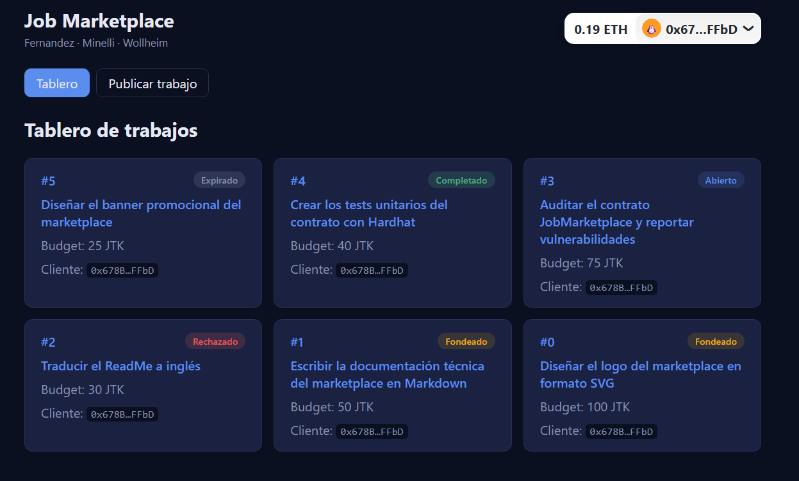

### Detalle de trabajo — panel del proveedor (entrega vía IPFS)

El trabajo en estado `Funded` y la wallet conectada es el proveedor: aparece el formulario de
entrega, que sube el contenido a IPFS (`se sube a IPFS`) y manda on-chain solo el `bytes32`.

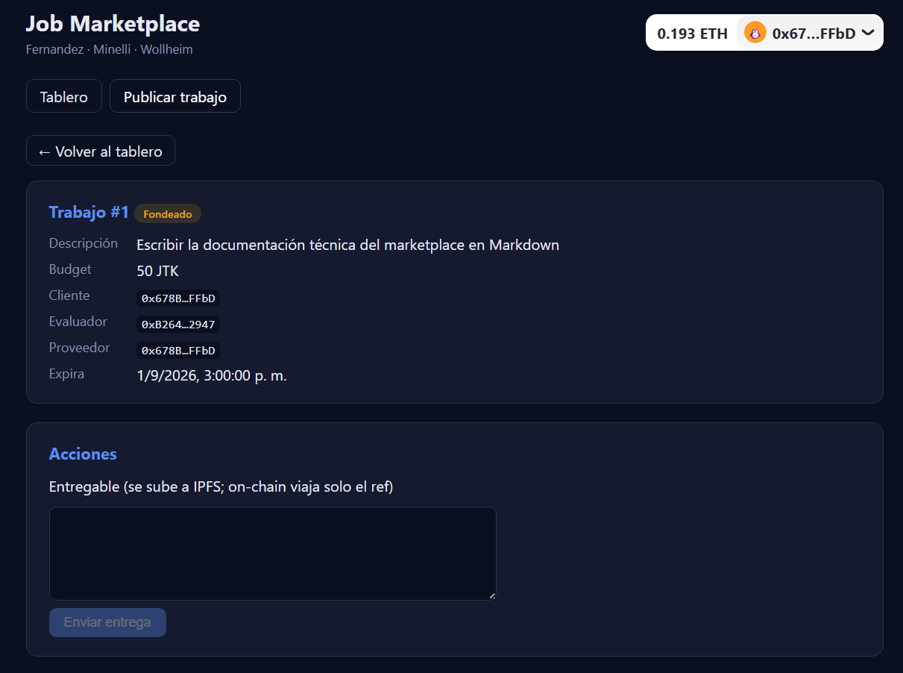

### Detalle de trabajo — panel de acciones según rol

El mismo trabajo desde una wallet que no tiene un rol accionable en ese estado: el panel muestra
"No tenés acciones disponibles", evidenciando el control de acceso por rol en la UI.

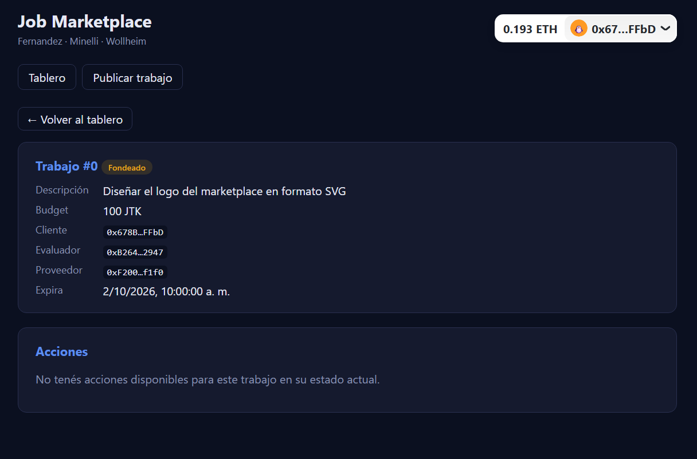

### Detalle de trabajo — panel del cliente en estado `Open`

Trabajo en `Open` sin proveedor, visto por el cliente: el panel ofrece **Asignar proveedor**,
**Fondear** (approve → fund) y **Rechazar**.

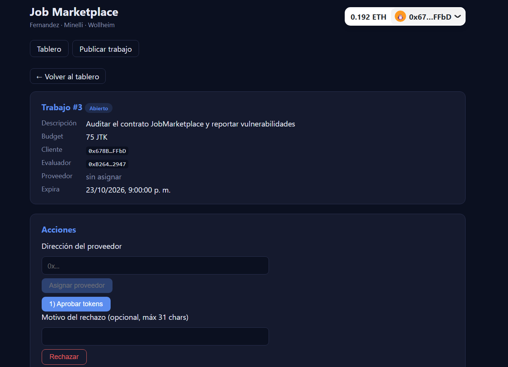

### Trabajo completado — ciclo completo

Happy path cerrado: el evaluador aprobó la entrega y se liberó el pago al proveedor. El trabajo
queda en estado **Completado**.

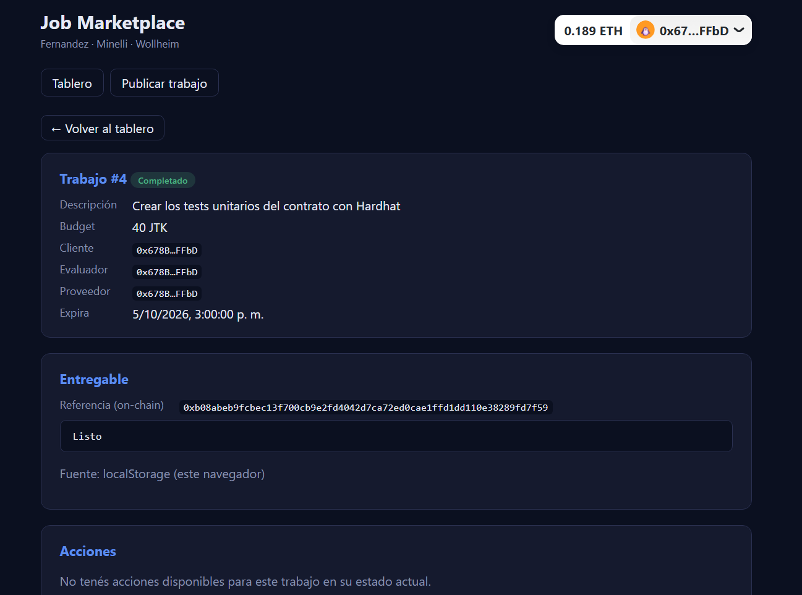

### Expiración — `claimRefund` tras el vencimiento

Trabajo `Funded` cuyo `expiresAt` ya pasó: aparece **Reclamar reembolso**, una acción sin control
de acceso (la puede llamar cualquiera). Al ejecutarla, se reembolsa al cliente y el trabajo pasa a
**Expirado**.

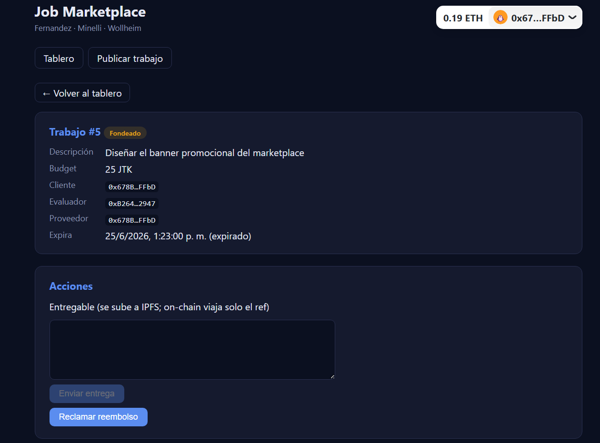

### MultiSig como evaluador (flujo end-to-end)

Cuando el evaluador de un trabajo es un contrato MultiSig, la aprobación no se hace desde esta UI:
hay que crear una propuesta en el MultiSig que llame a `complete()`, y aprobarla con M de N signers.

**1. Trabajo con el MultiSig como evaluador.** El trabajo #6 tiene como evaluador la dirección del
MultiSig; el panel de acciones indica que la aprobación va por una propuesta del MultiSig.

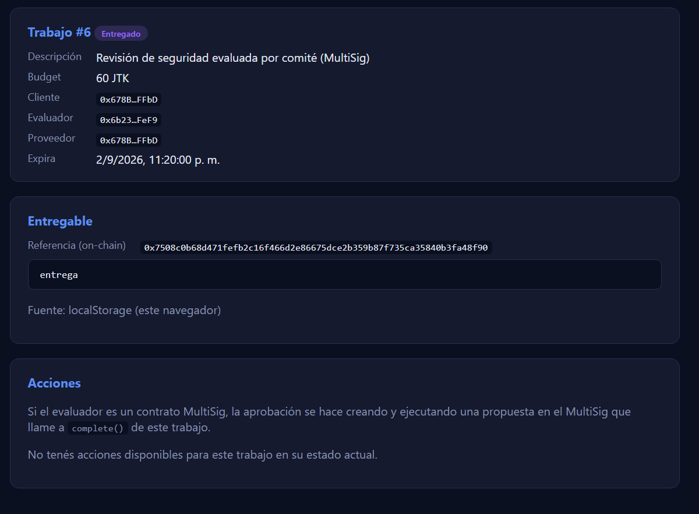

**2. Creación de la propuesta.** En la interfaz del MultiSig se crea una propuesta con
`target` = JobMarketplace, `value` = 0 y la `calldata` de `complete(jobId, reason)`.

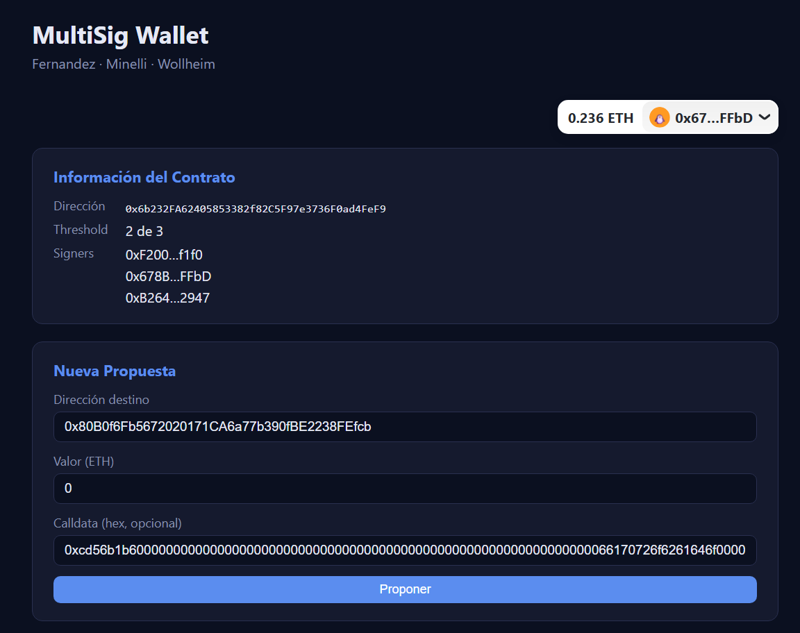

**3. Consenso M-de-N.** La propuesta requiere 2 de 3 aprobaciones (threshold). Un solo signer no
alcanza: hace falta una segunda aprobación de otro signer.

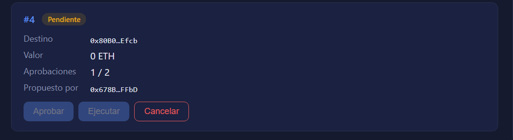

**4. Ejecución y pago liberado.** Con la segunda aprobación la propuesta llega a **2/2** y se
**ejecuta**: el MultiSig llama a `complete()`, el trabajo #6 pasa a **Completado** y los 60 JTK se
liberan al proveedor. Esto demuestra que el pago solo se libera tras el consenso del comité.

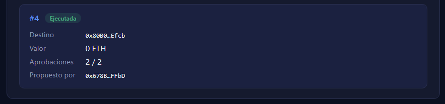

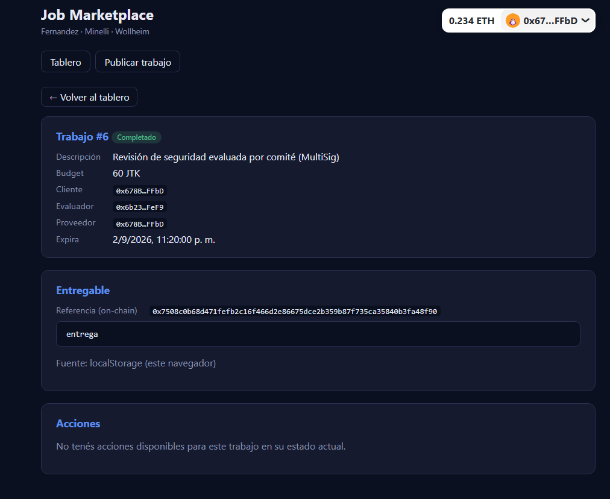
